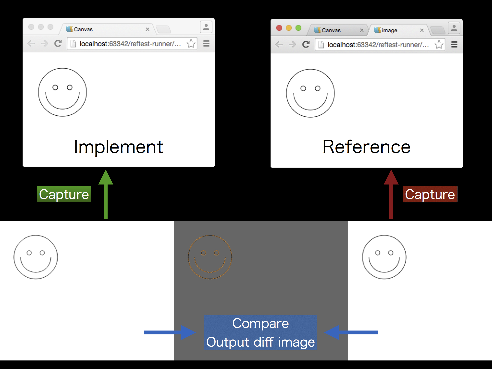

# reftest-runner docs

## Overview

[reftest-runner-overview.pdf](./reftest-runner-overview.pdf) help you to  better understand.

## Server

Reftest-runner has internal static server, but you can use own implemented server.

- [user-defined-server.md](./user-defined-server.md)